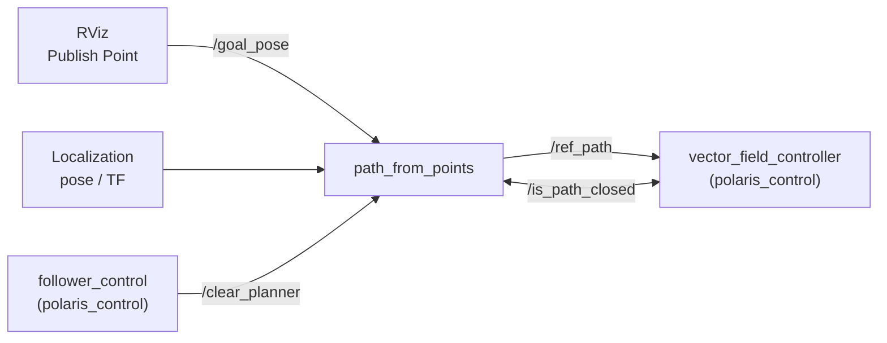

# Polaris Planning — Path Generation

This document describes how to run **polaris_planning**, how its planner nodes work, and how they connect to **polaris_control**.

For the full stack integration view, see the repository [README.md](../../README.md).

---

## Quick reference — planner nodes

| Executable | Source | Input | Best for |
|---|---|---|---|
| `path_from_points` | [`src/path_from_points.cpp`](../src/path_from_points.cpp) | RViz waypoints (`/goal_pose`) | Interactive navigation (default in integrated launches) |
| `path_from_file` | [`src/path_from_file.cpp`](../src/path_from_file.cpp) | Text file in `path_txt/` | Replaying recorded or hand-authored paths |
| `path_from_equation` | [`src/path_from_equation.cpp`](../src/path_from_equation.cpp) | Parametric curve params in YAML | Demos, benchmarks, closed-loop testing |

Only one planner node should run at a time (all use node name `planner`).

---

## Quick reference — launch files

| Launch file | Default planner | RViz config |
|---|---|---|
| [`launch/launch_planner.xml`](../launch/launch_planner.xml) | `path_from_points` | `config/visualizer.rviz` |
| [`launch/demo.xml`](../launch/demo.xml) | `path_from_equation` | `config/visualizer.rviz` |

Integrated stacks in **polaris_control** (`navigation.launch.py`, `safe_nav_stack.launch.py`) launch `path_from_points` directly — you do not need a separate planner launch in normal operation.

---

## How to run (dummy workflow)

### Standalone planner + RViz

```bash
cd ~/polaris_ws
colcon build --symlink-install --packages-select polaris_planning
source install/setup.bash

ros2 launch polaris_planning launch_planner.xml
```

To switch planner type, edit `launch_planner.xml` and uncomment exactly one `<node>` block.

### With polaris_control (typical deployment)

The control package launches the planner for you:

```bash
ros2 launch polaris_control navigation.launch.py
```

See [polaris_control/docs/NAVIGATION_AND_CONTROL.md](../../polaris_control/docs/NAVIGATION_AND_CONTROL.md) for the full two-terminal workflow.

### Sending goals and managing paths

With `path_from_points` running:

```bash
# Click goals in RViz on /goal_pose, or publish manually:
ros2 topic pub --once /goal_pose geometry_msgs/msg/PoseStamped \
  "{header: {frame_id: 'map'}, pose: {position: {x: 2.0, y: 1.0, z: 0.0}}}"

# Explicitly (re)plan and publish path
ros2 service call /start_planner std_srvs/srv/Trigger {}

# Clear all waypoints and path
ros2 service call /clear_planner std_srvs/srv/Trigger {}

# Remove last waypoint
ros2 service call /remove_last_point std_srvs/srv/Trigger {}

# Close path loop (adds robot position, marks path as closed)
ros2 service call /close_path std_srvs/srv/Trigger {}
```

---

## Architecture — how planners integrate with control



### Integration points

| polaris_planning output | polaris_control consumer | Purpose |
|---|---|---|
| `/ref_path` (`nav_msgs/Path`) | `vector_field_controller` | Reference curve for vector-field tracking |
| `/is_path_closed` (`Trigger` service) | `vector_field_controller` | Open paths stop at goal; closed paths loop forever |
| `/clear_planner` (service, called by follower) | `path_from_points` | Reset waypoints when mission FSM stops |

Topic names are configurable but must match on both sides. Default integrated setup:

- Planner config: [`config/path_from_points.yaml`](../config/path_from_points.yaml) → `/ref_path`
- Controller config: `polaris_control/config/pioneer_params.yaml` → `ref_path` (same topic)

---

## Planner details

### path_from_points (interactive waypoint planner)

The primary planner for field use. Workflow:

1. Subscribe to robot pose (TF, Odometry, or `PoseWithCovarianceStamped`).
2. Receive waypoints on `/goal_pose` (RViz **Publish Point** or **2D Goal Pose**).
3. Interpolate between waypoints and publish `nav_msgs/Path` on `/ref_path`.
4. Expose services to start, clear, close, and query path topology.

**Pose gating:** Before publishing, the planner refreshes pose from TF. If localization is not ready, planning is skipped rather than generating a path from `(0, 0, 0)`.

**Interpolation methods** (`flag_interpolation_method` in YAML):

| Value | Method |
|---|---|
| 1 | Linear |
| 2 | Quadratic (Hermite-style segments) |
| 3 | Cubic spline (default fallback) |
| 4 | Hermite |

Segment density is controlled by `max_point_distance` (minimum spacing between sampled path points).

**Closed vs open paths:**

- Open path (default): controller stops near the final point using `goal_tolerance`.
- Closed path (`/close_path` service): controller loops; no goal-stop logic.

#### Subscribed topics

| Topic | Type | Default | Description |
|---|---|---|---|
| `clicked_point_topic_name` | `PoseStamped` | `/goal_pose` | Waypoints from RViz |
| `pose_topic_name` | TF / Odometry / AMCL | `/tf` | Robot pose for path origin and close-path logic |

#### Published topics

| Topic | Type | Default | Description |
|---|---|---|---|
| `path_topic_name` | `Path` | `/ref_path` | Interpolated reference path for the controller |
| `visualization_topic_name` | `MarkerArray` | `/visual_path` | Path and waypoint markers for RViz |

#### Services

| Service | Default name | Description |
|---|---|---|
| Start planner | `/start_planner` | Interpolate current waypoints and publish path |
| Clear planner | `/clear_planner` | Remove all waypoints; publish empty path |
| Remove last point | `/remove_last_point` | Pop last waypoint |
| Close path | `/close_path` | Append robot position and mark path closed |
| Is path closed | `/is_path_closed` | Returns `success=true` if path is closed |

---

### path_from_file (file replay)

Loads a polyline from `path_txt/path_N.txt` at startup and publishes it once.

**File format:**

```txt
N          # number of points
x1 y1 z1
x2 y2 z2
...
```

Sample files: `path_txt/path_1.txt` … `path_4.txt`.

Configure in [`config/path_from_file.yaml`](../config/path_from_file.yaml):

- `pkg_path` — absolute path to this package source (update for your machine)
- `path_number` — which `path_N.txt` to load
- `path_topic_name` — defaults to `/espeleo/path` (remap to `/ref_path` for polaris_control)

No interactive services; path is published once on node start.

---

### path_from_equation (parametric curves)

Generates paths from built-in parametric templates. Useful for demos and controller tuning without a map.

**Curve templates** (`path_number` in YAML):

| Value | Shape |
|---|---|
| 1 | Ellipse |
| 2 | Figure-eight |
| 3 | Rectangle-like |
| 4 | Sine curve |

Parameters `a`, `b`, `phi`, `cx`, `cy` scale, rotate, and translate the curve. Set `closed_path_flag: true` for looping paths.

Configure in [`config/path_from_equation.yaml`](../config/path_from_equation.yaml). Remap `publish_path_topic_name` to `/ref_path` when pairing with polaris_control.

---

## Main files

### Source

| File | Executable | Description |
|---|---|---|
| [`src/path_from_points.cpp`](../src/path_from_points.cpp) | `path_from_points` | Interactive waypoint planner with interpolation and services |
| [`src/path_from_file.cpp`](../src/path_from_file.cpp) | `path_from_file` | One-shot file loader |
| [`src/path_from_equation.cpp`](../src/path_from_equation.cpp) | `path_from_equation` | Parametric curve generator |

### Configuration

| File | Used by |
|---|---|
| [`config/path_from_points.yaml`](../config/path_from_points.yaml) | `path_from_points` — topics, interpolation, frame IDs |
| [`config/path_from_file.yaml`](../config/path_from_file.yaml) | `path_from_file` |
| [`config/path_from_equation.yaml`](../config/path_from_equation.yaml) | `path_from_equation` |
| [`config/visualizer.rviz`](../config/visualizer.rviz) | Standalone planner launches |

### Launch

| File | Description |
|---|---|
| [`launch/launch_planner.xml`](../launch/launch_planner.xml) | Standalone planner + RViz; select one planner node |
| [`launch/demo.xml`](../launch/demo.xml) | Demo with equation-based planner |

### Data and utilities

| Path | Description |
|---|---|
| [`path_txt/`](../path_txt/) | Sample paths for `path_from_file` |
| [`scripts/tf_fixed.py`](../scripts/tf_fixed.py) | Static TF broadcaster for bench testing |
| [`srv/Trigger.srv`](../srv/Trigger.srv) | Legacy custom service definition (planners use `std_srvs/Trigger`) |

### Build metadata

| File | Role |
|---|---|
| [`CMakeLists.txt`](../CMakeLists.txt) | Builds all three planner executables; installs config and launch |
| [`package.xml`](../package.xml) | ROS 2 package manifest |

---

## Configuration reference (`path_from_points.yaml`)

Key parameters for integration with polaris_control:

```yaml
path_topic_name: "/ref_path"           # must match controller path_topic_name
clicked_point_topic_name: "/goal_pose"
tf_reference_frame: "map"              # global frame
tf_robot_pose: "body"                  # robot base frame
flag_interpolation_method: 1           # 1=linear, 2=quadratic, 3=cubic, 4=hermite
max_point_distance: 0.2                # path sample spacing (m)
N_points: 8                            # legacy param; segment density also uses max_point_distance
```

Pose source options (`pose_topic_type`):

- `TFMessage` — listen on `/tf` for `tf_reference_frame` → `tf_robot_pose`
- `Odometry` — subscribe to `pose_topic_name`
- `PoseWithCovarianceStamped` — e.g. `/amcl_pose`

Match these settings with the controller and follower pose configuration in `polaris_control/config/pioneer_params.yaml` or `scout_params.yaml`.

---

## Typical deployment combinations

| Scenario | Planner | How to launch |
|---|---|---|
| Normal field navigation | `path_from_points` | `ros2 launch polaris_control navigation.launch.py` |
| Debug planner only | `path_from_points` | `ros2 launch polaris_planning launch_planner.xml` |
| Replay recorded path | `path_from_file` | Edit `launch_planner.xml`, set `path_topic_name: /ref_path` |
| Controller tuning on curve | `path_from_equation` | `ros2 launch polaris_planning demo.xml` + control nodes separately |

---

## Related documentation

- [Repository README — planning + control integration](../../README.md)
- [polaris_control — navigation and control stack](../../polaris_control/docs/NAVIGATION_AND_CONTROL.md)
- [polaris_planning README](../README.md) — original package readme
