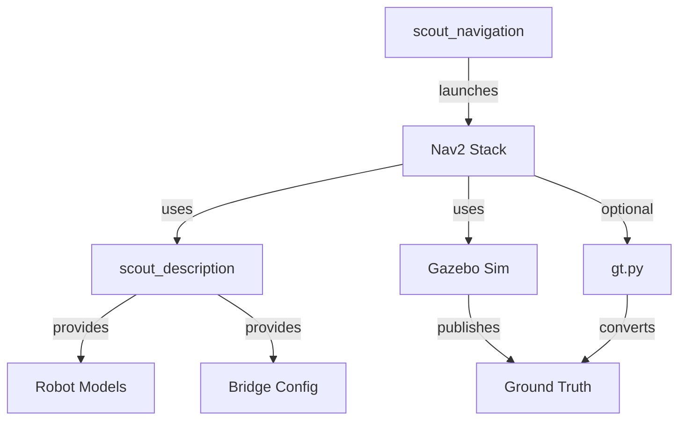

# Scout Mini Simulation in Gazebo Harmonic (ROS 2 Jazzy)

 <!-- Add actual image if available -->

This repository contains ROS 2 Jazzy packages for simulating the Scout Mini robot in Gazebo Harmonic. It includes essential configurations, launch files, and robot models for seamless integration with ROS 2.

## Key Features

- URDF/Xacro model of the Scout Mini
- Gazebo Harmonic integration
- ROS 2 Jazzy launch and configuration files
- Sensor simulation (LiDAR, IMU, etc.)
- Pre-configured test worlds
- ROS-Gazebo bridge configuration

## Package: `scout_description`

The core description package containing all physical and kinematic representations of the Scout Mini robot.

### Package Structure

| Directory | Contents |
|-----------|----------|
| **meshes/** | 3D mesh files for visual representation (chassis, wheels, etc.) |
| **worlds/** | Gazebo simulation environments for testing |
| **sdf/** | Robot model in SDF format (`model.sdf`) for Gazebo |
| **urdf/** | Robot description in URDF/Xacro format |
| **params/** | ROS-Gazebo bridge parameters |
| **launch/** | Launch files for simulation setup |

### Launch Files

#### `spawn.launch.py`
Main launch file that:
- Spawns the robot model in Gazebo
- Configures the ROS-Gazebo bridge
- Sets up simulation environment
- Handles namespacing and parameters
- Manages Gazebo resource paths

## Getting Started

```bash
# Clone the repository
git clone https://github.com/UFMG-Petrobras-OP-1319/scout-gz.git

# Build the workspace
colcon build --symlink-install

# Launch simulation
ros2 launch scout_description spawn.launch.py
```

## Package: `scout_gazebo_sim`

The simulation package that handles Gazebo integration and ROS 2 communication for the Scout Mini robot.

### Package Structure

| Directory | Contents |
|-----------|----------|
| **meshes/** | 3D mesh files for visual representation |
| **worlds/** | Gazebo simulation environments |
| **sdf/** | SDF model files for Gazebo simulation |
| **urdf/** | URDF/Xacro model files |
| **params/** | ROS-Gazebo bridge configuration parameters |
| **launch/** | Simulation launch files |

### Launch Files

#### `scout_mini_sdf.launch.py`
Launches an empty Gazebo world with SDF model integration:
- Starts Gazebo with empty world
- Spawns the Scout Mini using SDF model description
- Configures ROS-Gazebo bridge for communication
- Sets up all necessary topics and services

#### `scout_mini_urdf.launch.py`
Alternative launch using URDF model:
- Similar functionality to SDF version
- Uses URDF/Xacro model instead of SDF
- Maintains same bridge configuration
- Useful for RViz visualization compatibility
- Includes additional transform publishers for URDF compatibility

### Usage Examples

```bash
# Launch with SDF model
ros2 launch scout_gazebo_sim scout_mini_sdf.launch.py

# Launch with URDF model
ros2 launch scout_gazebo_sim scout_mini_urdf.launch.py
```

## Package: `scout_navigation`

The navigation stack package for the Scout Mini robot, providing all necessary configurations for autonomous navigation using Nav2.

### Package Structure

| Directory | Contents |
|-----------|----------|
| **launch/** | Navigation launch files |
| **params/** | Navigation and bridge parameters |
| **scripts/** | Utility scripts for navigation |

### Key Components

#### Launch Files

**`nav2_scout_mini.launch.py`**  
Main navigation launch file that:
- Starts a complete Nav2 navigation stack
- Launches Gazebo simulation with Scout Mini
  - *Uses robot models from `scout_description` package*
  - *Calls `spawn.launch.py` from `scout_description`*
- Configures SLAM or pre-loaded maps
- Sets up RViz visualization
- Handles robot spawning and world loading
- Manages ROS-Gazebo bridge for ground truth data
  - *Bridge parameters come from `scout_description/params/bridge.yaml`*
- *Note:* Currently does **not** automatically launch `gt.py` (must be run separately)

#### Parameters

**`nav2_params.yaml`**  
Navigation configuration containing:
- Behavior tree configurations
- Controller server parameters
- Planner server settings
- Recovery behaviors
- Costmap configurations (global and local)
- Scout Mini-specific motion parameters

**`scout_description/params/bridge.yaml`**  
ROS-Gazebo bridge configuration that:
- Publishes ground truth poses from Gazebo to ROS
- Maps Gazebo topics to ROS topics
- Converts between Gazebo and ROS message types
- Specifically handles:
  - `/tf_gt` topic (ground truth poses)
  - Converts `gz.msgs.Pose_V` to `tf2_msgs/msg/TFMessage`

#### Scripts

**`gt.py`**  
Utility script that:
- Subscribes to `/tf_gt` topic (Gazebo ground truth)
- Publishes odometry transform (`odom` → `base_footprint`)
- Maintains accurate positioning for navigation
- Helps align simulation with real-world behavior

#### System Diagram



### Typical Usage

```bash
# Launch the navigation stack
ros2 launch scout_navigation nav2_scout_mini.launch.py
